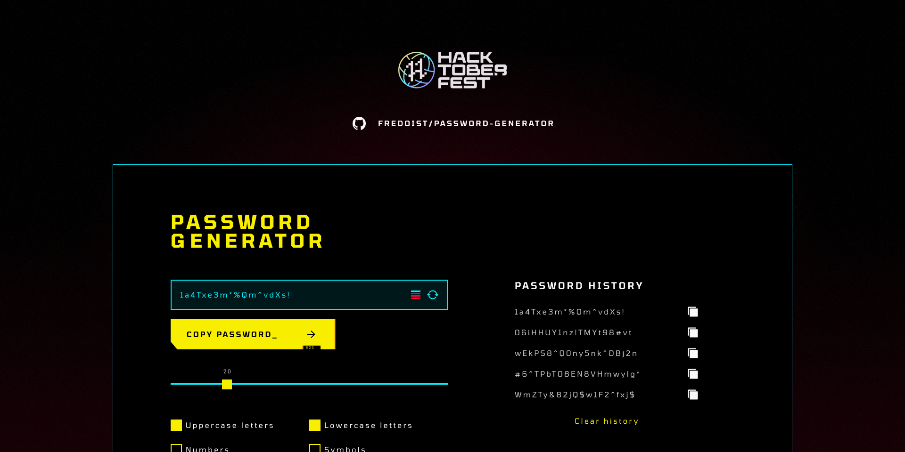

 
<h3 align="center">Password Generator</h3>

  Cyberpunk-themed Password Generator built using Astro and Svelte

 

  
  &nbsp;
  
  &nbsp;
  
  &nbsp;
  
  &nbsp;
  
  &nbsp;

## About the project

A hackathon project built for the Hacktoberfest 2022 event by [midudev](https://github.com/midudev). The project was inspired by the recent release of Cyberpunk: Edgerunners in Netflix.

## Features

The main hackathon requirements were to create a password generator which included a slider for password length and a copy button. My hackathon entry included the following features:

- Randomly generate a password.
- Change the desired password length, by default is set to 18 characters.
- Set chars to include in password such as lowercase letters, uppercase letters, numbers, and symbols.
- See password strength as you generate it.
- Past generated password log.
- Keyboard shortcuts for key features.
- Ambient sound and animations.

## Built using

## Source Code

Find this project source code in the following routes:

- [pages](https://github.com/midudev/password-generator/tree/main/src/pages/fredoist)
- [components](https://github.com/midudev/password-generator/tree/main/src/components/fredoist)
- [hooks](https://github.com/midudev/password-generator/tree/main/src/hooks/fredoist)
- [assets](https://github.com/midudev/password-generator/tree/main/public/fredoist)

## Contribute

This project is not accepting PRs at this moment, but you can always [open an issue](https://github.com/fredoist/password-generator/issues/new) if you find a bug.
